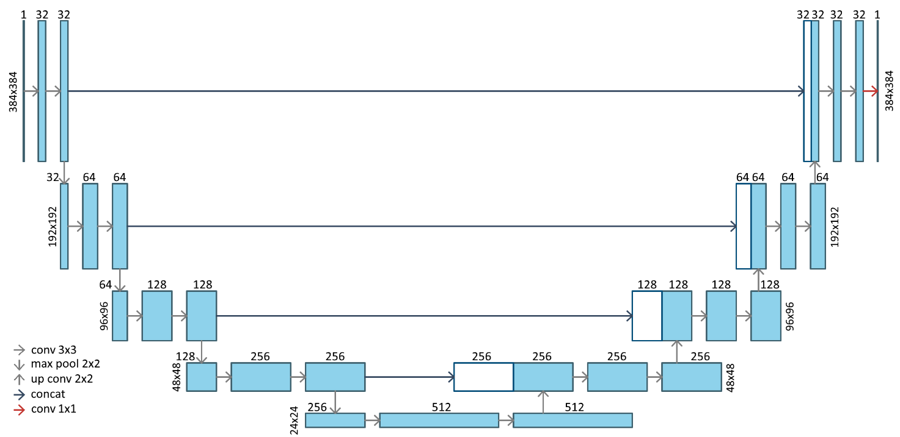
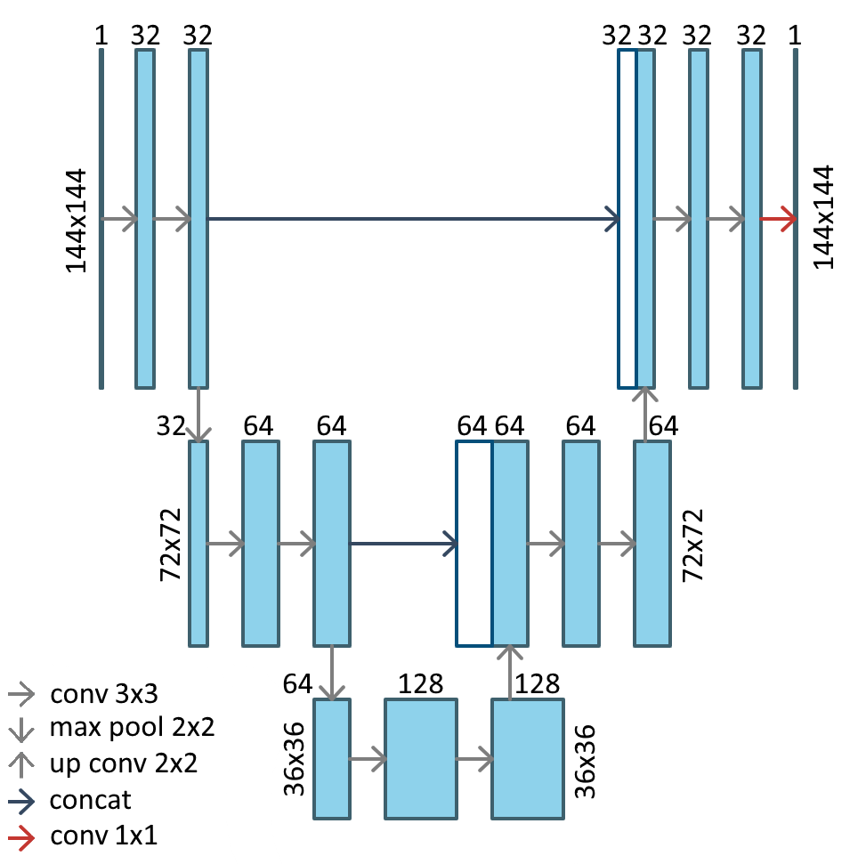
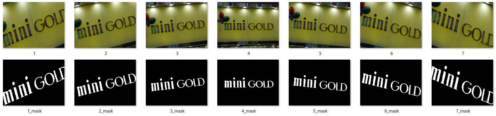

Реализация свёрточной нейронной сети U-Net для алгоритма распознавания надписей на изображениях реальных сцен.

Для обучения используются 2 конфигурации сети: первая используется для конечного обучения сети U-Net; вторая используется для проверочных обучений.

В качестве базы изображений была выбрана база KAIST Scene Text Database (http://www.iapr-tc11.org/mediawiki/index.php/KAIST_Scene_Text_Database), из которой было выбрано 1215 фотографий различных вывесок, содержащих текст на английском и корейском языке. Изображения были получены с помощью цифровой камеры высокого разрешения или мобильного телефона с низким разрешением. Все изображения были приведены к размеру 640×480 пикселя.
Для определения расположения текста для каждого изображения представлено изображение-маска, на котором черным цветом выделен фон, а красным – текст.

В работе было проведено искусственное увеличение базы изображений за счёт поворотов и обрезки изображений. Повороты производились в обе стороны от минус 18° до плюс 18° с шагом в 6°. Размер базы после увеличения составляет 8505 изображений. Также все маски были переведены в чёрно-белый формат.

Дополнительным способом увеличения базы изображений являлась подача на вход сети как сжатых до размеров, используемых для обучаемой структуры сети, так и разбитых на 4 части с перекрытием изображений. Размер базы после увеличения составляет 42525 изображений 

В таблице представлены параметры оценки обучения, валидации и тестирования для обучения на конечной сети при использовании полной базы изображений (повороты, сжатие и разбиение). Обучение производилось в течении 5 эпох и заняло 60 часов.

| Параметр | Тип  | Результат  |
| ------ | --- | ---: |
| Коэффициент Дайса | Обучение | 0,911 |
|  | Валидация | 0,900 |
|  | Тестирование | 0,880 |
| Точность | Обучение | 0,915 |
|  | Валидация | 0,917 |
|  | Тестирование | 0,902 |
| Валидация | Обучение | 0,902 |
|  | Валидация | 0,882 |
|  | Тестирование | 0,864 |
| Тестирование | Обучение | 0,908 |
|  | Валидация | 0,900 |
|  | Тестирование | 0,883  |
